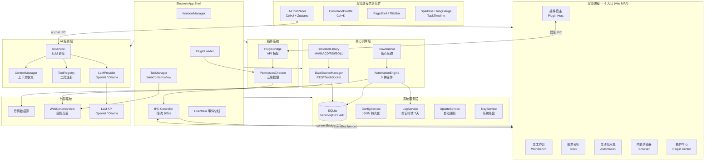
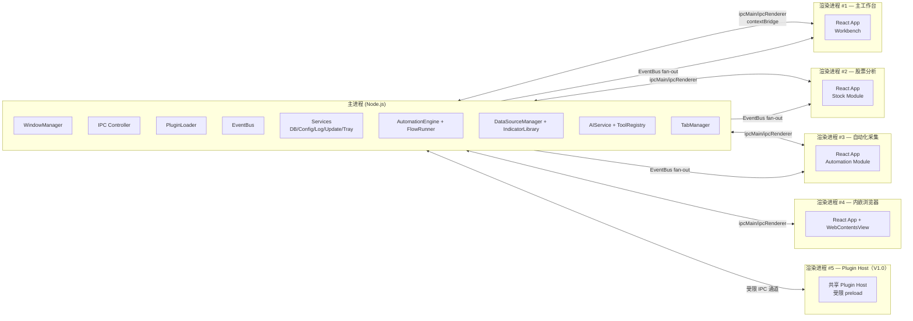
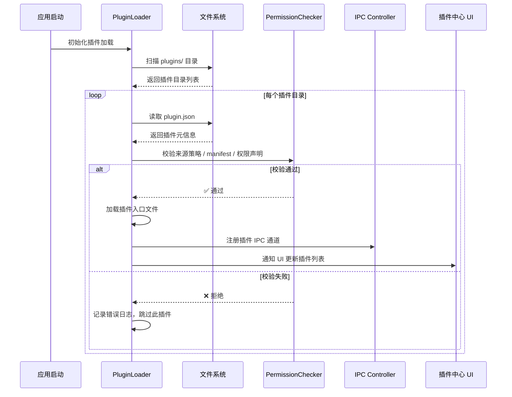
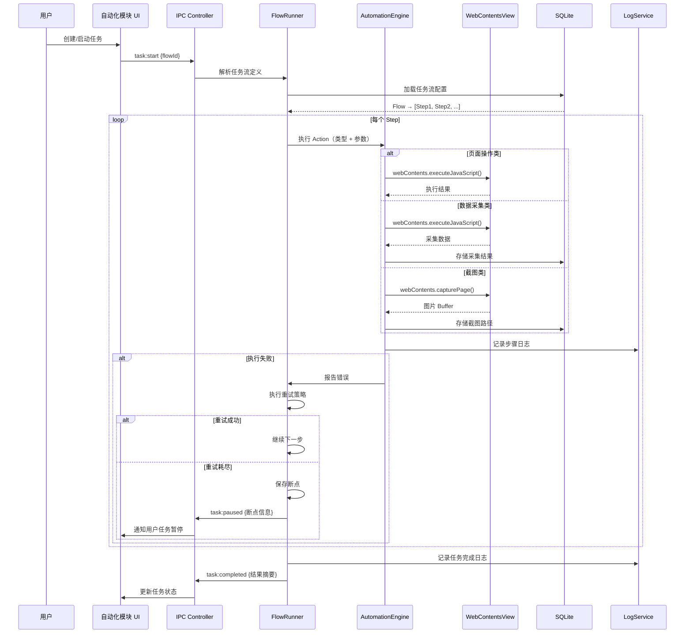
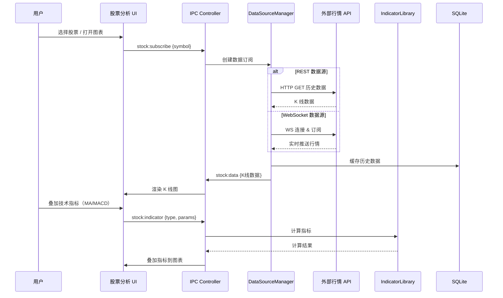
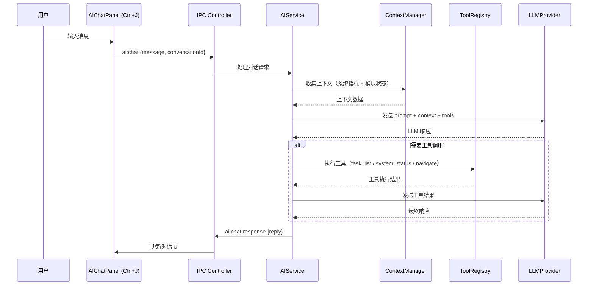
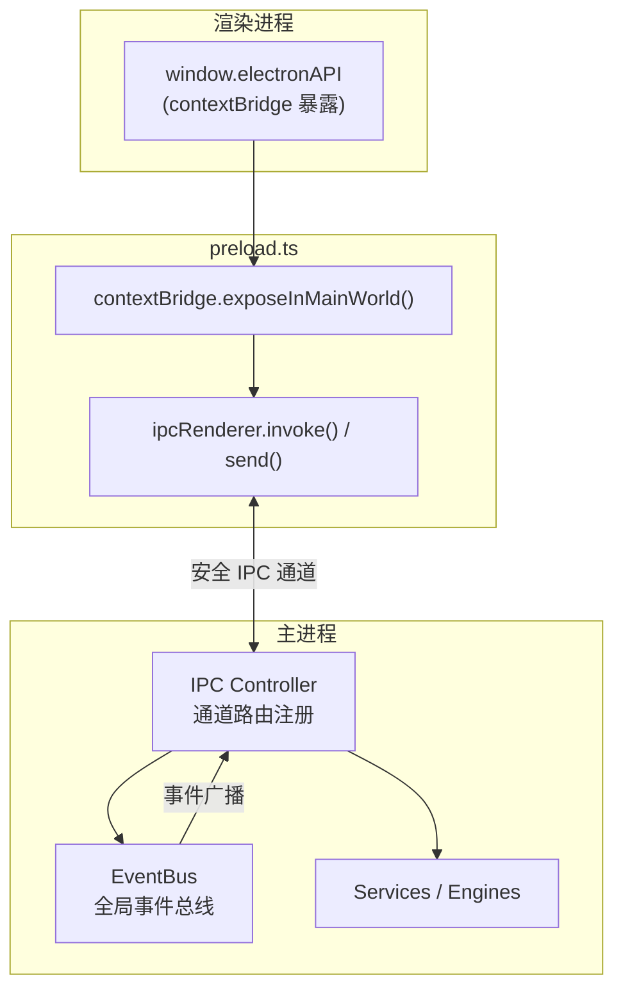
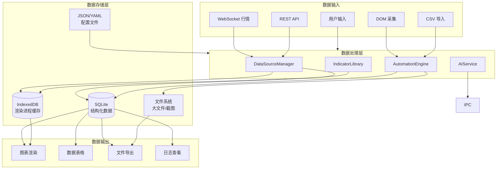
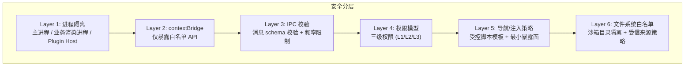

# 🏗️ YClaw 技术架构文档

> 模块架构 / 进程模型 / 调用链路 / 技术选型

---

## 文档定位

| 文档 | 说明 |
| --- | --- |
| `docs/architecture.md` | 描述当前系统架构与核心链路 |
| `docs/current-status.md` | 描述当前实现完成度与限制 |
| `docs/structure.md` | 描述实际目录结构与模块职责 |

> 本文档以“当前仓库已存在的实现”为主，同时保留长期演进方向说明。
> 如遇“规划目标”和“当前落地状态”不完全一致，请以 `docs/current-status.md` 为现状基线。

## 当前实现快照

| 维度 | 当前情况 |
| --- | --- |
| 进程结构 | 1 个主进程 + 多业务渲染入口 + 1 个 `plugin-host` 宿主入口 |
| 渲染入口 | `workbench`、`stock`、`automation`、`browser`、`plugin-center`，外加 `plugin-host` |
| 主进程服务 | 配置、数据库、日志、托盘、更新、特性包、调度、批次、模板、结果、告警等 |
| 核心边界 | Electron IPC + `contextBridge` + 共享类型与常量 |
| 当前重点 | 自动化 Browser Ops、AI 助手、插件权限、构建/打包链路 |

---

## 1. 模块架构总览



---

## 2. 进程模型



### 进程隔离策略

| 进程类型                | 数量        | 权限                  | 说明                                            |
| ----------------------- | ----------- | --------------------- | ----------------------------------------------- |
| 主进程                  | 1           | 完整 Node.js API      | 系统服务、引擎、插件管理                        |
| 渲染进程（模块）        | N（按模块） | 受限（contextBridge） | 每个业务模块独立渲染进程                        |
| 渲染进程（Plugin Host） | 1（V1.0）   | 高度受限 preload      | 受信插件 UI 的共享宿主；V1.5 再升级为按插件隔离 |

---

## 3. 核心调用链路

### 3.1 插件加载链路



### 3.2 自动化任务执行链路



### 3.3 数据分析链路



### 3.4 AI 对话链路



---

## 4. IPC 通信架构



### IPC 通道命名规范

```
{module}:{action}:{detail?}

示例：
  task:start              # 启动任务
  task:pause              # 暂停任务
  stock:subscribe         # 订阅行情
  stock:indicator:calc    # 计算指标
  plugin:install          # 安装插件
  plugin:permission:check # 权限检查
  config:get              # 读取配置
  config:set              # 写入配置
  log:export              # 导出日志
```

---

## 5. 数据流架构



---

## 6. 技术选型表

### 核心框架

| 模块       | 技术选型   | 版本要求 | 选型理由                                        |
| ---------- | ---------- | -------- | ----------------------------------------------- |
| 桌面框架   | Electron   | 33       | WebContentsView 支持、Chromium 内核复用、跨平台 |
| UI 框架    | React      | 18       | 生态丰富、组件化、Concurrent Mode               |
| 构建工具   | Vite       | 6        | 原生 MPA 支持、HMR 极速、Rollup 生态            |
| TypeScript | TypeScript | 5.7      | 类型安全、IPC 消息类型校验                      |

### 状态管理 & UI

| 模块      | 技术选型                         | 选型理由                           |
| --------- | -------------------------------- | ---------------------------------- |
| 状态管理  | Zustand 5                        | 轻量、无样板代码、支持持久化中间件 |
| 路由      | React Router v6                  | 每个入口独立路由实例               |
| UI 组件库 | Ant Design 5 + Pro Components    | 企业级组件库、可定制主题           |
| 图表库    | Lightweight Charts (TradingView) | 专业金融图表、K 线原生支持、高性能 |
| CSS 方案  | CSS Modules                      | 模块化样式隔离                     |

### 数据 & 存储

| 模块         | 技术选型                          | 选型理由                       |
| ------------ | --------------------------------- | ------------------------------ |
| 结构化数据库 | better-sqlite3                    | 同步 API、零网络开销、嵌入式   |
| 文件存储     | Node.js fs + electron app.getPath | 平台无关的应用数据路径         |
| 渲染端缓存   | IndexedDB（原生/轻封装）          | 渲染进程本地缓存、大数据量支持 |
| 配置管理     | ConfigService (JSON 持久化)       | 经 EventBus 广播配置变更       |

### 引擎 & 运行时

| 模块         | 技术选型                 | 选型理由                              |
| ------------ | ------------------------ | ------------------------------------- |
| 自动化引擎   | Electron webContents API | 复用内置 Chromium，无需额外浏览器依赖 |
| 技术指标计算 | IndicatorLibrary (内置)  | MA/MACD/RSI/BOLL 等指标计算           |
| 日志         | LogService (内置)        | 文件按日轮转、7 天保留                |

### 构建 & 打包

| 模块          | 技术选型                                      | 选型理由                         |
| ------------- | --------------------------------------------- | -------------------------------- |
| Electron 打包 | electron-builder                              | dmg/nsis/AppImage 全平台支持     |
| 自动更新      | electron-updater                              | 配合 electron-builder 的增量更新 |
| 测试框架      | Vitest 2 + @testing-library/react + happy-dom | Vite 原生测试 + 组件测试         |

### 插件系统

| 模块             | 技术选型                        | 选型理由                             |
| ---------------- | ------------------------------- | ------------------------------------ |
| 插件宿主（V1.0） | 共享 plugin-host + 受限 preload | 先收敛到单一宿主模型，降低实现复杂度 |
| 插件通信         | IPC                             | 统一权限检查与错误处理链路           |
| 插件包格式       | .ycplugin (zip + plugin.json)   | 自定义包格式，V1.0 不引入签名体系    |

---

## 7. 安全架构



### 插件权限矩阵

| 能力                 | Level 1 (UI 只读) | Level 2 (网络+存储) | Level 3 (自动化+文件) |
| -------------------- | :---------------: | :-----------------: | :-------------------: |
| 渲染 UI              |        ✅         |         ✅          |          ✅           |
| 读取公开应用状态     |        ✅         |         ✅          |          ✅           |
| 网络请求             |        ❌         |         ✅          |          ✅           |
| 插件专属存储读写     |        ❌         |         ✅          |          ✅           |
| 用户文件系统访问     |        ❌         |         ❌          |   ✅（需逐次授权）    |
| 调用自动化引擎       |        ❌         |         ❌          |   ✅（需逐次授权）    |
| 操作 WebContentsView |        ❌         |         ❌          |   ✅（需逐次授权）    |
| 安装时需用户确认     |        ❌         |         ✅          |          ✅           |

---

## 8. 当前落地与后续演进边界

| 方向 | 当前已落地 | 后续演进 |
| --- | --- | --- |
| 插件系统 | 插件加载、基础权限校验、宿主页 | 按插件独立进程、资源隔离、进一步收敛 API 面 |
| 自动化 | 基础执行、断点重试、结果/批次/模板/干预链路 | 真实复杂页面适配、调度恢复、录制能力增强 |
| AI 助手 | Provider 抽象、工具注册、聊天面板 | 流式响应、更多工具、历史持久化增强 |
| 打包发布 | 构建与多平台打包命令已存在 | 发行质量、包体、签名、平台验证持续完善 |
