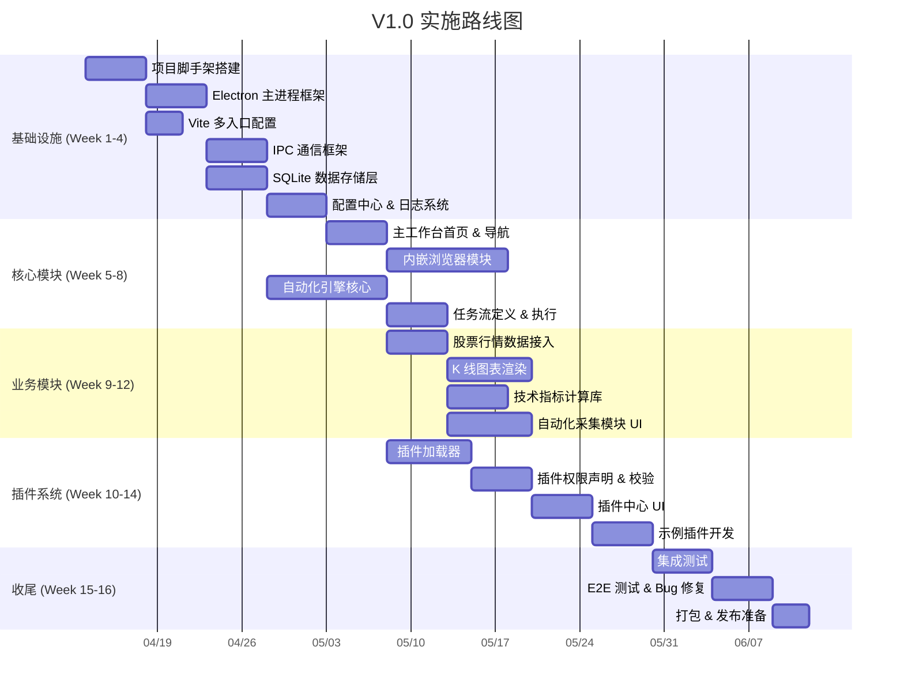

# 📋 YClaw 可行性分析与实施计划

---

## 文档定位

| 项目 | 说明 |
| --- | --- |
| 文档属性 | 本文档保留项目早期“可行性分析 + 阶段实施计划”的基线视角 |
| 当前关系 | 仓库当前已进入真实实现阶段，因此本文不等同于当前完成度清单 |
| 现状参考 | 当前代码落地情况请优先查看 `docs/overview/current-status.md` |
| 规格参考 | 功能验收基线请查看 `docs/specs/v1.0-baseline.md` 与 `docs/specs/v1.1-enhancements.md` |

> 阅读建议：把本文视为“阶段路线与风险分析”，而不是“最新功能完成列表”。

## 1. 技术可行性评估

### 1.1 逐模块评估

| 框架                 | 可行性  | 成熟度 | 风险等级 | 分析                                                         |
| -------------------- | :-----: | :----: | :------: | ------------------------------------------------------------ |
| Electron App Shell   | ✅ 可行 |   高   |  🟢 低   | Electron 33 已站稳，VS Code / Slack 等大型应用验证           |
| Vite 多入口构建      | ✅ 可行 |   高   |  🟢 低   | Vite 6 原生支持 MPA 模式，配置简单，HMR 完整支持             |
| 插件系统（基础版）   | ✅ 可行 |   中   |  🟡 中   | V1.0 先收敛到共享 plugin-host + 权限声明 + 受信来源策略      |
| 插件沙箱（进程级）   | ✅ 可行 |   中   |  🟡 中   | 适合作为 V1.5 演进方向                                       |
| 自动化引擎           | ✅ 可行 |   高   |  🟢 低   | webContents API 提供完整 DOM 操作能力                        |
| WebContentsView 管理 | ✅ 可行 |   中   |  🟡 中   | Electron 33 正式 API，需注意内存管理                         |
| 股票行情数据接入     | ✅ 可行 |   高   |  🟢 低   | REST/WebSocket 接入成熟方案                                  |
| K 线图表渲染         | ✅ 可行 |   高   |  🟢 低   | TradingView Lightweight Charts 专业金融图表库                |
| 技术指标计算         | ✅ 可行 |   高   |  🟢 低   | 内置 IndicatorLibrary 支持 MA/MACD/RSI/BOLL                  |
| SQLite 数据存储      | ✅ 可行 |   高   |  🟢 低   | better-sqlite3 WAL 模式，同步 API 简单高效                   |
| AI 服务层            | ✅ 可行 |   中   |  🟡 中   | OpenAI / Ollama Provider 抽象，工具调用框架已实现            |
| IPC 通信框架         | ✅ 可行 |   高   |  🟢 低   | contextBridge + ipcRenderer/ipcMain 安全模式，60+ 类型化通道 |
| 跨平台打包           | ✅ 可行 |   高   |  🟢 低   | electron-builder 全平台支持                                  |

### 1.2 综合评估

**总体结论：方案技术可行，V1.0 范围内无不可解决的技术障碍。**

核心技术栈（Electron + React + Vite）均为成熟方案，社区生态完善。主要挑战集中在：

1. 插件沙箱的安全性设计（可分阶段实现，V1.0 基础版 → V1.5 完整版）
2. WebContentsView 的稳定性实践（社区经验较少，需充分测试）
3. 多进程内存管理（每个模块独立渲染进程，需关注资源占用）

---

## 2. 风险识别与缓解

### 2.1 技术风险

| #   | 风险                                   | 影响                            | 概率 | 等级  | 缓解措施                                                                                               |
| --- | -------------------------------------- | ------------------------------- | :--: | :---: | ------------------------------------------------------------------------------------------------------ |
| R1  | **Electron 包体积过大**（基础 >150MB） | 用户下载体验差、磁盘占用高      |  高  | 🟡 中 | ① 启用 ASAR 打包压缩 ② 使用 @electron/universal 减少体积 ③ 增量更新减少后续下载量                      |
| R2  | **多渲染进程内存占用**                 | 基础模块全加载可能超 500MB 限制 |  中  | 🟡 中 | ① 模块窗口按需创建、空闲销毁 ② 设置进程内存上限告警 ③ 共享进程模式（多个模块复用渲染进程）             |
| R3  | **WebContentsView API 不稳定**         | 内嵌浏览器功能受限或有 Bug      |  中  | 🟡 中 | ① 紧跟 Electron Release Notes ② 封装抽象层便于切换 ③ 准备 webview tag 降级方案                         |
| R4  | **插件安全漏洞**                       | 恶意插件窃取数据或破坏系统      |  低  | 🔴 高 | ① V1.0 仅支持受信来源插件 ② 共享 plugin-host + 受限 preload ③ 权限逐次授权 ④ V1.5 再引入按插件进程隔离 |
| R5  | **Python 环境依赖**                    | 用户本地无 Python 或版本不兼容  |  中  | 🟡 中 | ① 启动时检测 Python 环境并提示 ② 提供 Python 基础策略的 JS 等价实现 ③ V2.0 引入 Pyodide 消除依赖       |
| R6  | **better-sqlite3 原生模块编译**        | 不同平台 / Node.js 版本编译失败 |  中  | 🟡 中 | ① 使用 electron-rebuild 确保兼容 ② 提供预编译二进制 ③ 备选：sql.js (WASM)                              |

### 2.2 业务风险

| #   | 风险             | 缓解措施                                         |
| --- | ---------------- | ------------------------------------------------ |
| B1  | 行情数据源合规性 | 仅接入用户自行配置的数据源，不内置第三方付费数据 |
| B2  | 自动化工具被滥用 | 内置访问频率限制、遵守 robots.txt、用户协议声明  |
| B3  | 插件生态冷启动   | V1.0 提供 3-5 个官方示例插件，降低开发者入门门槛 |

---

## 3. 实施路线图

### 3.1 V1.0 — 基础平台（预计 12-16 周）

### 3.2 V1.5 — 能力增强（预计 8-10 周）

| 周次   | 里程碑       | 关键交付                                                 |
| ------ | ------------ | -------------------------------------------------------- |
| W1-W3  | 自动化增强   | 可视化任务流编辑器（拖拽式 Flow 编辑）                   |
| W3-W5  | 指标库扩展   | 新增 10+ 技术指标、自定义指标支持                        |
| W4-W7  | 插件沙箱升级 | 按插件进程级隔离、资源限制（CPU/内存配额）、更细粒度授权 |
| W6-W8  | 日志中心增强 | 结构化日志查询、错误追踪聚合、一键导出调试包             |
| W8-W10 | 集成与发布   | 回归测试、性能优化、V1.5 发布                            |

### 3.3 V2.0 — 生态扩展（预计 12-16 周）

| 周次    | 里程碑       | 关键交付                                        |
| ------- | ------------ | ----------------------------------------------- |
| W1-W4   | RPA 工作流   | 可视化流程编辑器（类 Node-RED）、条件分支、循环 |
| W3-W6   | 策略回测     | 回测框架、历史数据管理、收益曲线图表            |
| W5-W8   | 插件生态     | 插件市场 UI、插件发布流程、评分系统             |
| W7-W10  | 云能力       | 配置云同步、团队共享空间                        |
| W10-W12 | Pyodide 集成 | WASM 版 Python 运行时、消除本地 Python 依赖     |
| W12-W16 | 稳定化       | 性能调优、安全审计、V2.0 发布                   |

---

## 4. 资源需求

### 4.1 人力需求

| 角色                | 人数 | 职责                                          |   V1.0 阶段投入    |
| ------------------- | :--: | --------------------------------------------- | :----------------: |
| Electron 开发工程师 | 1-2  | 主进程框架、窗口管理、IPC、插件系统、打包     |        100%        |
| 前端开发工程师      | 1-2  | React 多入口模块、UI 组件、图表、样式         |        100%        |
| 全栈 / 引擎开发     |  1   | 自动化引擎、数据分析引擎、Python 桥接、SQLite |        100%        |
| 测试工程师          | 0.5  | 单元测试、集成测试、E2E 测试                  | 50%（W12 起 100%） |

**最小团队规模：3 人全职**（Electron + 前端 + 引擎各 1 人，测试复用开发角色）
**理想团队规模：5 人**

### 4.2 基础设施需求

| 资源               | 说明                                                      |
| ------------------ | --------------------------------------------------------- |
| 代码仓库           | GitHub / GitLab（Monorepo）                               |
| CI/CD              | GitHub Actions（自动构建 + 测试 + 发布）                  |
| 构建机器           | macOS (dmg) + Windows (nsis) + Linux (AppImage) CI runner |
| 包分发             | GitHub Releases / 自建更新服务器                          |
| 行情数据源（测试） | 免费 API（如 Alpha Vantage / Yahoo Finance）              |

### 4.3 关键技术决策记录

| 决策点           | 选择                              | 理由                            | 替代方案                             |
| ---------------- | --------------------------------- | ------------------------------- | ------------------------------------ |
| 桌面框架         | Electron 33                       | WebContentsView 支持、生态成熟  | Tauri（包体积小但 WebView 能力不足） |
| 构建工具         | Vite 6                            | 原生 MPA 支持、极速 HMR         | Webpack（过重、配置繁琐）            |
| 状态管理         | Zustand 5                         | 轻量无样板、原生支持持久化      | Redux Toolkit（功能强但过于复杂）    |
| 数据库           | better-sqlite3                    | 同步 API 简洁、WAL 模式性能优异 | sql.js（WASM 无编译问题但性能较低）  |
| 图表库           | TradingView Lightweight Charts    | 专业金融图表、高性能            | ECharts（通用但金融图表定制成本高）  |
| UI 组件库        | Ant Design 5 + Pro Components     | 企业级组件、可定制主题          | Material UI（重量级）                |
| 插件宿主（V1.0） | 共享 plugin-host                  | 降低首版复杂度                  | 独立 BrowserWindow（V1.5）           |
| 测试框架         | Vitest 2 + @testing-library/react | Vite 原生测试 + 组件测试        | Jest（对 ESM 支持较差）              |

---

## 5. 成功标准

### V1.0 发布标准

- [x] 5 个多入口模块全部可独立加载运行
- [x] 自动化引擎支持：点击、输入、滚动、采集、截图 5 种基础操作
- [x] 任务流支持 ≥ 10 步串行执行，错误重试 + 断点续跑
- [x] 内嵌浏览器支持多标签页 ≥ 20 个
- [x] 股票模块支持 K 线渲染 + 4 种指标（MA/MACD/RSI/BOLL）
- [x] 插件系统支持安装/卸载/启用/禁用，具备三级权限校验
- [x] SQLite WAL 模式数据库服务
- [x] IPC 通信框架 60+ 类型化通道 + EventBus
- [x] 单元测试覆盖：38 文件, 370+ 测试
- [ ] 应用冷启动到主界面可交互 < 2s
- [ ] 基础模块全加载内存 < 500MB
- [ ] macOS + Windows 双平台打包可用
- [ ] E2E 核心流程覆盖

### V1.1 发布标准（已完成）

- [x] AI 服务层：AIService + ContextManager + ToolRegistry + LLMProvider
- [x] AI 对话面板（AIChatPanel, Ctrl+J）
- [x] 命令面板（CommandPalette, Ctrl+K）
- [x] 增强 UI 组件：Sparkline, RingGauge, TaskTimeline
- [x] 全局 Loading 状态管理（GlobalLoading + useLoading）
- [x] AI 服务层单元测试覆盖
- [x] UI 组件单元测试覆盖
- [x] 回归测试覆盖
