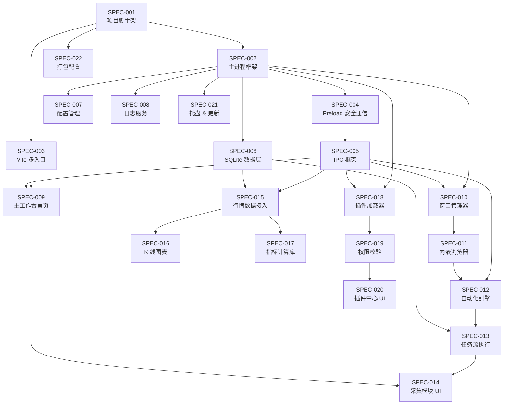

# 📦 YClaw V1.0 Spec 拆解文档

> 基于 PRD V1.0 版本规划，拆解为可执行的独立 Spec 单元
>
> V1.1 增强 Spec（SPEC-023 ~ SPEC-028）见 [specs-enhancements.md](specs-enhancements.md)

---

## Spec 总览

| ID       | 标题                             | 模块      | 优先级 | 状态 | 依赖               |
| -------- | -------------------------------- | --------- | :----: | :--: | ------------------ |
| SPEC-001 | 项目脚手架 & 构建配置            | 基础设施  |   P0   |  ✅  | —                  |
| SPEC-002 | Electron 主进程框架              | App Shell |   P0   |  ✅  | SPEC-001           |
| SPEC-003 | Vite 多入口构建配置              | 基础设施  |   P0   |  ✅  | SPEC-001           |
| SPEC-004 | Preload & contextBridge 安全通信 | IPC       |   P0   |  ✅  | SPEC-002           |
| SPEC-005 | IPC 通信框架 & 事件总线          | IPC       |   P0   |  ✅  | SPEC-004           |
| SPEC-006 | SQLite 数据存储层                | 数据层    |   P0   |  ✅  | SPEC-002           |
| SPEC-007 | 配置管理服务                     | 系统服务  |   P1   |  ✅  | SPEC-002           |
| SPEC-008 | 日志服务                         | 系统服务  |   P1   |  ✅  | SPEC-002           |
| SPEC-009 | 主工作台首页 & 模块导航          | 工作台    |   P0   |  ✅  | SPEC-003, SPEC-005 |
| SPEC-010 | 窗口管理器                       | App Shell |   P0   |  ✅  | SPEC-002, SPEC-005 |
| SPEC-011 | 内嵌浏览器模块                   | 浏览器    |   P0   |  ✅  | SPEC-010           |
| SPEC-012 | 自动化引擎核心                   | 自动化    |   P0   |  ✅  | SPEC-005, SPEC-011 |
| SPEC-013 | 任务流定义 & 执行                | 自动化    |   P0   |  ✅  | SPEC-012, SPEC-006 |
| SPEC-014 | 自动化采集模块 UI                | 自动化    |   P1   |  ✅  | SPEC-013, SPEC-009 |
| SPEC-015 | 股票行情数据接入                 | 分析      |   P1   |  ✅  | SPEC-005, SPEC-006 |
| SPEC-016 | K 线图表渲染                     | 分析      |   P1   |  ✅  | SPEC-015           |
| SPEC-017 | 技术指标计算库                   | 分析      |   P1   |  ✅  | SPEC-015           |
| SPEC-018 | 插件加载器                       | 插件系统  |   P1   |  ✅  | SPEC-002, SPEC-005 |
| SPEC-019 | 插件权限声明 & 校验              | 插件系统  |   P1   |  ✅  | SPEC-018           |
| SPEC-020 | 插件中心 UI                      | 插件系统  |   P2   |  ✅  | SPEC-018, SPEC-019 |
| SPEC-021 | 系统托盘 & 自动更新              | App Shell |   P2   |  ✅  | SPEC-002           |
| SPEC-022 | 跨平台打包配置                   | 基础设施  |   P1   |  ✅  | SPEC-001           |

### 依赖关系图

---

## Spec 详细定义

---

### SPEC-001: 项目脚手架 & 构建配置

| 属性       | 值       |
| ---------- | -------- |
| **模块**   | 基础设施 |
| **优先级** | P0       |
| **复杂度** | M        |
| **依赖**   | 无       |

**描述**：初始化项目仓库，配置 TypeScript、ESLint、Prettier，搭建 Monorepo 目录结构。

**验收标准**：

- [x] `package.json` 包含所有基础依赖（electron、react、vite、typescript 等）
- [x] `tsconfig.json` / `tsconfig.main.json` / `tsconfig.renderer.json` 配置正确
- [x] ESLint + Prettier 配置完成，`npm run lint` 可执行
- [x] 目录结构与 `structure.md` 一致（src/main、src/renderer/entries、src/shared、src/engines）
- [x] `.gitignore` 包含 node_modules/、dist/、\*.sqlite 等
- [x] `npm install` 无报错

---

### SPEC-002: Electron 主进程框架

| 属性       | 值        |
| ---------- | --------- |
| **模块**   | App Shell |
| **优先级** | P0        |
| **复杂度** | M         |
| **依赖**   | SPEC-001  |

**描述**：实现 Electron 主进程入口，包含应用生命周期管理（ready、window-all-closed、activate）、基础 BrowserWindow 创建。

**验收标准**：

- [x] `src/main/index.ts` 作为主进程入口可启动应用
- [x] `app.ts` 管理应用生命周期事件
- [x] 开发模式下加载 Vite Dev Server URL
- [x] 生产模式下加载本地 HTML 文件
- [x] macOS 下关闭窗口不退出应用（activate 重建窗口）
- [x] 进程崩溃保护：uncaughtException / unhandledRejection 捕获

---

### SPEC-003: Vite 多入口构建配置

| 属性       | 值       |
| ---------- | -------- |
| **模块**   | 基础设施 |
| **优先级** | P0       |
| **复杂度** | S        |
| **依赖**   | SPEC-001 |

**描述**：配置 Vite 支持多入口 MPA 模式，每个业务模块拥有独立的 HTML 入口。

**验收标准**：

- [x] `vite.config.ts` 配置 rollupOptions.input 包含 5 个入口 + 1 个 plugin-host
- [x] `npm run dev` 启动 Vite Dev Server，所有入口 HMR 正常
- [x] `npm run build` 产出独立的 HTML/JS/CSS 到 dist/renderer/ 各子目录
- [x] React + TypeScript + CSS 在所有入口中正常工作
- [x] 共享代码（src/renderer/shared）不被重复打包（Vite 自动 chunk 拆分）

---

### SPEC-004: Preload & contextBridge 安全通信

| 属性       | 值       |
| ---------- | -------- |
| **模块**   | IPC      |
| **优先级** | P0       |
| **复杂度** | M        |
| **依赖**   | SPEC-002 |

**描述**：实现 preload 脚本，通过 contextBridge 安全暴露 API 到渲染进程，确保不暴露 Node.js API。

**验收标准**：

- [x] `src/main/windows/preload.ts` 通过 contextBridge 暴露 `window.electronAPI`
- [x] 暴露的 API 包含 `invoke(channel, ...args)` 和 `on(channel, callback)`
- [x] BrowserWindow 配置 `contextIsolation: true`、`nodeIntegration: false`
- [x] 渲染进程无法直接访问 `require`、`process`、`fs` 等 Node.js API
- [x] TypeScript 类型定义正确（`src/shared/types/ipc.ts` 提供 `window.electronAPI` 类型）

---

### SPEC-005: IPC 通信框架 & 事件总线

| 属性       | 值       |
| ---------- | -------- |
| **模块**   | IPC      |
| **优先级** | P0       |
| **复杂度** | L        |
| **依赖**   | SPEC-004 |

**描述**：实现主进程侧 IPC 路由注册、消息分发、全局事件总线。渲染进程侧提供 `useIpc` Hook。

**验收标准**：

- [x] `IpcController.ts` 支持 `handle(channel, handler)` 注册 IPC 路由
- [x] `channels.ts` 定义类型安全的通道名常量（`{module}:{action}` 格式）
- [x] `EventBus.ts` 基于 EventEmitter 实现跨模块事件发布/订阅
- [x] 渲染进程通过 `useIpc()` Hook 调用 `invoke` / 监听事件
- [x] IPC 消息包含基础 schema 校验（zod / typebox）
- [x] IPC 消息频率限制（每通道每秒 ≤ 100 次）
- [x] 错误通道统一格式：`{ code, message, data? }`

---

### SPEC-006: SQLite 数据存储层

| 属性       | 值       |
| ---------- | -------- |
| **模块**   | 数据层   |
| **优先级** | P0       |
| **复杂度** | M        |
| **依赖**   | SPEC-002 |

**描述**：封装 better-sqlite3，提供数据库服务，管理表结构迁移。

**验收标准**：

- [x] `DatabaseService.ts` 封装 better-sqlite3，支持 `query`、`run`、`get`、`all` 方法
- [x] 数据库文件存储在 `app.getPath('userData')/databases/` 目录
- [x] 支持基础迁移机制（migration 版本号 + SQL 文件）
- [x] 初始表结构包含：tasks、task_steps、stock_data、plugins、configs、logs
- [ ] 常规查询响应 < 50ms（1 万行数据）
- [x] 应用退出时正确关闭数据库连接
- [x] WAL 模式启用（提升并发读写性能）

---

### SPEC-007: 配置管理服务

| 属性       | 值       |
| ---------- | -------- |
| **模块**   | 系统服务 |
| **优先级** | P1       |
| **复杂度** | S        |
| **依赖**   | SPEC-002 |

**描述**：实现全局配置、模块配置的读写、持久化、备份导出。

**验收标准**：

- [x] `ConfigService.ts` 基于 electron-store 实现配置持久化
- [x] 支持全局配置（主题、语言、启动行为）和模块配置（各模块独立命名空间）
- [x] 提供 `get(key)`、`set(key, value)`、`getAll()`、`reset()` API
- [x] 配置变更时通过 EventBus 广播通知
- [x] 支持配置文件导出（JSON）和导入

---

### SPEC-008: 日志服务

| 属性       | 值       |
| ---------- | -------- |
| **模块**   | 系统服务 |
| **优先级** | P1       |
| **复杂度** | S        |
| **依赖**   | SPEC-002 |

**描述**：统一日志服务，支持分级日志、文件轮转、多来源标记。

**验收标准**：

- [x] `LogService.ts` 基于 electron-log 或 winston 实现
- [x] 支持 debug/info/warn/error 四级日志
- [x] 日志包含来源标记（main/renderer/plugin/engine）
- [x] 文件日志按日轮转，保留 7 天
- [x] 日志文件存储在 `app.getPath('userData')/logs/`
- [x] 渲染进程通过 IPC 发送日志到主进程统一处理
- [x] 提供导出调试包功能（打包近 3 天日志 + 系统信息）

---

### SPEC-009: 主工作台首页 & 模块导航

| 属性       | 值                 |
| ---------- | ------------------ |
| **模块**   | 工作台             |
| **优先级** | P0                 |
| **复杂度** | M                  |
| **依赖**   | SPEC-003, SPEC-005 |

**描述**：实现主工作台首页，展示模块导航卡片，点击可打开对应模块窗口。

**验收标准**：

- [x] 主工作台 `workbench` 入口作为应用默认窗口
- [x] 首页展示模块导航卡片：股票分析、自动化采集、内嵌浏览器、插件中心
- [x] 点击卡片通过 IPC 请求主进程打开对应模块窗口
- [x] 卡片显示模块图标、名称、简要描述
- [x] 侧边栏导航支持在模块间快速切换
- [x] 响应式布局，窗口缩放时卡片自适应排列

---

### SPEC-010: 窗口管理器

| 属性       | 值                 |
| ---------- | ------------------ |
| **模块**   | App Shell          |
| **优先级** | P0                 |
| **复杂度** | L                  |
| **依赖**   | SPEC-002, SPEC-005 |

**描述**：管理所有模块窗口的创建、销毁、状态记忆、焦点控制。

**验收标准**：

- [x] `WindowManager.ts` 维护窗口注册表（windowId → BrowserWindow 映射）
- [x] 支持按模块名创建窗口，每个模块加载对应入口 HTML
- [x] 窗口位置和大小记忆（关闭后重新打开恢复上次状态）
- [x] 支持同一模块多窗口实例（如多个浏览器窗口）
- [x] 窗口间通信通过 EventBus 中转
- [x] 所有业务窗口关闭后不退出应用（回到主工作台）
- [x] 窗口数量上限控制（默认 ≤ 10 个）

---

### SPEC-011: 内嵌浏览器模块

| 属性       | 值       |
| ---------- | -------- |
| **模块**   | 浏览器   |
| **优先级** | P0       |
| **复杂度** | XL       |
| **依赖**   | SPEC-010 |

**描述**：实现多标签页内嵌浏览器，基于 WebContentsView，支持会话隔离和受控脚本执行。

**验收标准**：

- [x] 多标签页管理：新建、关闭、切换标签页
- [x] 每个标签页为独立 WebContentsView 实例
- [x] 地址栏输入 URL 导航、前进/后退/刷新
- [ ] 会话隔离：按工作区或浏览器配置文件使用独立 Session
- [x] 支持注入 JS 脚本（通过 webContents.executeJavaScript）
- [x] 支持受控脚本执行（仅自动化引擎内部脚本模板）
- [x] 标签页数量 ≥ 20 时性能稳定
- [x] 页面加载状态指示（loading / 标题更新 / favicon）

---

### SPEC-012: 自动化引擎核心

| 属性       | 值                 |
| ---------- | ------------------ |
| **模块**   | 自动化             |
| **优先级** | P0                 |
| **复杂度** | XL                 |
| **依赖**   | SPEC-005, SPEC-011 |

**描述**：实现通过 WebContentsView.webContents 操作页面的自动化引擎，支持 5 种基础操作。

**验收标准**：

- [x] `AutomationEngine.ts` 提供统一操作接口
- [x] 支持操作：click（点击）、input（输入）、scroll（滚动）、extract（内容采集）、screenshot（截图）
- [x] 操作通过 CSS 选择器 / XPath 定位目标元素
- [x] `SelectorGenerator.ts` 支持从元素生成唯一选择器
- [x] 操作结果统一格式返回 `{ success, data?, error? }`
- [x] 操作超时控制（默认 30s，可配置）
- [x] 操作执行日志记录（通过 LogService）

---

### SPEC-013: 任务流定义 & 执行

| 属性       | 值                 |
| ---------- | ------------------ |
| **模块**   | 自动化             |
| **优先级** | P0                 |
| **复杂度** | L                  |
| **依赖**   | SPEC-012, SPEC-006 |

**描述**：实现任务流（Flow → Step → Action）的定义、持久化、执行、错误重试和断点继续。

**验收标准**：

- [x] 任务流 JSON Schema 定义：`{ id, name, steps: [{ action, selector, params, ... }] }`
- [x] `FlowRunner.ts` 按顺序执行 Step，每步调用 AutomationEngine
- [x] 任务流配置存储在 SQLite（tasks / task_steps 表）
- [x] 错误重试：每步最多重试 3 次（可配置），重试间隔递增
- [x] 断点继续：任务失败时保存当前步骤位置，支持从断点恢复执行
- [x] 任务执行状态实时推送到渲染进程（通过 IPC 事件）
- [x] 支持 ≥ 10 步串行任务执行

---

### SPEC-014: 自动化采集模块 UI

| 属性       | 值                 |
| ---------- | ------------------ |
| **模块**   | 自动化             |
| **优先级** | P1                 |
| **复杂度** | L                  |
| **依赖**   | SPEC-013, SPEC-009 |

**描述**：自动化采集模块的前端界面，包含任务列表、任务编辑器、执行面板。

**验收标准**：

- [x] 任务列表页面：展示所有任务（名称、状态、上次执行时间）
- [x] 任务编辑页面：可视化编辑任务步骤（添加/删除/排序 Step）
- [x] 每个 Step 可选择动作类型、填写选择器和参数
- [x] 任务执行面板：实时展示当前步骤、执行日志、进度
- [x] 支持任务的启动、暂停、停止操作
- [x] 失败任务支持“从断点继续”按钮

---

### SPEC-015: 股票行情数据接入

| 属性       | 值                 |
| ---------- | ------------------ |
| **模块**   | 分析               |
| **优先级** | P1                 |
| **复杂度** | M                  |
| **依赖**   | SPEC-005, SPEC-006 |

**描述**：实现行情数据源管理，支持 REST 和 WebSocket 两种接入方式。

**验收标准**：

- [x] `DataSourceManager.ts` 管理数据源连接的创建和销毁
- [x] 支持 REST 接口获取历史 K 线数据
- [x] 支持 WebSocket 接收实时行情推送
- [x] 数据源配置可由用户自定义（URL、认证信息、请求格式）
- [x] 历史数据缓存到 SQLite（避免重复请求）
- [x] 数据格式统一为标准 OHLCV（Open/High/Low/Close/Volume）
- [x] 连接异常自动重连（最多 5 次，间隔递增）

---

### SPEC-016: K 线图表渲染

| 属性       | 值       |
| ---------- | -------- |
| **模块**   | 分析     |
| **优先级** | P1       |
| **复杂度** | L        |
| **依赖**   | SPEC-015 |

**描述**：基于 TradingView Lightweight Charts 实现 K 线图渲染及指标叠加。

**验收标准**：

- [x] `KLineChart.tsx` 组件渲染标准 K 线图（日线/周线/月线切换）
- [x] 支持缩放、拖拽、十字光标
- [x] 支持叠加技术指标线（MA/MACD/RSI 等，来自 SPEC-017）
- [ ] 支持分时图显示
- [ ] 数据量 ≥ 1000 根 K 线时渲染流畅（FPS ≥ 30）
- [ ] 实时数据推送时图表自动更新（最新 K 线追加/更新）

---

### SPEC-017: 技术指标计算库

| 属性       | 值       |
| ---------- | -------- |
| **模块**   | 分析     |
| **优先级** | P1       |
| **复杂度** | M        |
| **依赖**   | SPEC-015 |

**描述**：封装技术指标计算，V1.0 支持 MA、MACD、RSI 三种基础指标。

**验收标准**：

- [x] `IndicatorLibrary.ts` 提供统一计算接口 `calculate(type, data, params)`
- [x] 支持指标：MA（移动平均线，可配置周期）、MACD（12/26/9 默认参数）、RSI（14 默认周期）、BOLL
- [ ] 计算在 Worker 线程中执行（不阻塞主进程/渲染进程）
- [x] 输入：OHLCV 数组；输出：指标值数组（与 K 线数据索引对齐）
- [ ] 10000 根 K 线数据的指标计算 < 100ms

---

### SPEC-018: 插件加载器

| 属性       | 值                 |
| ---------- | ------------------ |
| **模块**   | 插件系统           |
| **优先级** | P1                 |
| **复杂度** | L                  |
| **依赖**   | SPEC-002, SPEC-005 |

**描述**：实现插件的扫描、加载、注册、生命周期管理。

**验收标准**：

- [x] `PluginLoader.ts` 启动时扫描 `{userData}/plugins/` 目录
- [x] 读取每个插件的 `plugin.json` 元信息（名称、版本、入口、权限声明、来源）
- [x] 校验 plugin.json Schema 合法性（必填字段检查）
- [x] 维护已加载插件注册表
- [x] 支持插件生命周期：install → activate → deactivate → uninstall
- [x] V1.0 中插件 UI 统一通过 `plugin-host` 宿主页加载
- [x] 插件安装/卸载操作记录日志

---

### SPEC-019: 插件权限声明 & 校验

| 属性       | 值       |
| ---------- | -------- |
| **模块**   | 插件系统 |
| **优先级** | P1       |
| **复杂度** | M        |
| **依赖**   | SPEC-018 |

**描述**：实现插件权限声明机制和基础校验（V1.0 受信来源模式）。

**验收标准**：

- [x] `plugin.json` 中 `permissions` 字段定义插件所需权限
- [x] `permissionLevel` 字段声明权限等级（1/2/3）
- [x] `source` 字段声明插件来源（`builtin` / `official` / `local`）
- [x] `PermissionChecker.ts` 在插件加载时校验权限声明
- [x] Level 2/3 插件安装时弹出权限确认对话框
- [x] 插件 API 调用时检查权限（未授权操作返回 PermissionDenied 错误）
- [x] 受信来源策略配置存储在 ConfigService 中

---

### SPEC-020: 插件中心 UI

| 属性       | 值                 |
| ---------- | ------------------ |
| **模块**   | 插件系统           |
| **优先级** | P2                 |
| **复杂度** | M                  |
| **依赖**   | SPEC-018, SPEC-019 |

**描述**：插件中心前端界面，展示已安装插件、支持安装/卸载/启用/禁用操作。

**验收标准**：

- [x] 插件列表页面：展示所有已安装插件（名称、版本、状态、权限等级）
- [x] 插件卡片支持启用/禁用切换
- [x] 插件详情页面：展示完整信息、权限声明、操作按钮
- [x] 支持从本地文件安装插件（.ycplugin 文件选择）
- [x] 卸载插件需二次确认
- [x] 权限授权弹窗（PermissionDialog）展示插件请求的权限列表

---

### SPEC-021: 系统托盘 & 自动更新

| 属性       | 值        |
| ---------- | --------- |
| **模块**   | App Shell |
| **优先级** | P2        |
| **复杂度** | S         |
| **依赖**   | SPEC-002  |

**描述**：实现系统托盘图标、菜单，以及自动更新检测与安装。

**验收标准**：

- [x] 系统托盘图标显示应用状态
- [x] 托盘右键菜单：显示主窗口、检查更新、退出
- [x] 关闭主窗口时最小化到托盘（可配置）
- [x] `UpdateService.ts` 基于 electron-updater 检查更新
- [x] 发现新版本时通知用户，支持后台下载 + 退出时安装

---

### SPEC-022: 跨平台打包配置

| 属性       | 值       |
| ---------- | -------- |
| **模块**   | 基础设施 |
| **优先级** | P1       |
| **复杂度** | M        |
| **依赖**   | SPEC-001 |

**描述**：配置 electron-builder 实现 macOS 和 Windows 打包。

**验收标准**：

- [x] `electron-builder.yml` 配置完成
- [x] macOS：生成 .dmg 安装包，支持代码签名配置（可选）
- [x] Windows：生成 .exe 安装包（NSIS）
- [x] ASAR 打包启用
- [x] better-sqlite3 原生模块正确重编译（electron-rebuild）
- [ ] 打包产物体积 < 200MB（含 Electron 运行时）
- [x] `npm run build:mac` 和 `npm run build:win` 命令可用

---

## 执行优先级排序

### 第一批（Week 1-4）— 地基

| 顺序 | Spec     | 说明                         |
| :--: | -------- | ---------------------------- |
|  1   | SPEC-001 | 项目脚手架（所有后续的基础） |
|  2   | SPEC-002 | 主进程框架                   |
|  3   | SPEC-003 | Vite 多入口                  |
|  4   | SPEC-004 | Preload 安全通信             |
|  5   | SPEC-005 | IPC 框架                     |
|  6   | SPEC-006 | SQLite 数据层                |
|  7   | SPEC-007 | 配置管理                     |
|  8   | SPEC-008 | 日志服务                     |

### 第二批（Week 5-8）— 核心模块

| 顺序 | Spec     | 说明         |
| :--: | -------- | ------------ |
|  9   | SPEC-009 | 主工作台首页 |
|  10  | SPEC-010 | 窗口管理器   |
|  11  | SPEC-011 | 内嵌浏览器   |
|  12  | SPEC-012 | 自动化引擎   |
|  13  | SPEC-013 | 任务流执行   |

### 第三批（Week 9-12）— 业务 & 插件

| 顺序 | Spec     | 说明         |
| :--: | -------- | ------------ |
|  14  | SPEC-014 | 采集模块 UI  |
|  15  | SPEC-015 | 行情数据接入 |
|  16  | SPEC-016 | K 线图表     |
|  17  | SPEC-017 | 指标计算库   |
|  18  | SPEC-018 | 插件加载器   |
|  19  | SPEC-019 | 权限校验     |

### 第四批（Week 13-16）— 收尾

| 顺序 | Spec     | 说明        |
| :--: | -------- | ----------- |
|  20  | SPEC-020 | 插件中心 UI |
|  21  | SPEC-021 | 托盘 & 更新 |
|  22  | SPEC-022 | 打包配置    |
